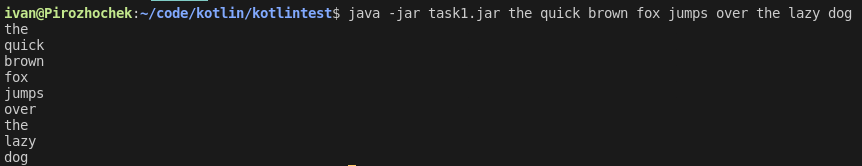
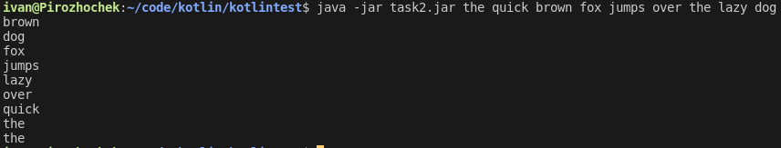
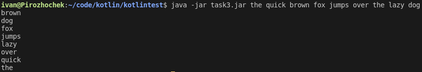
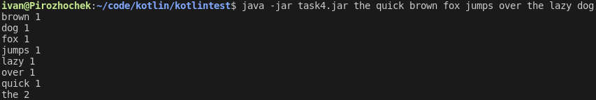
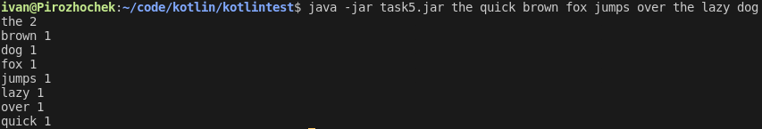
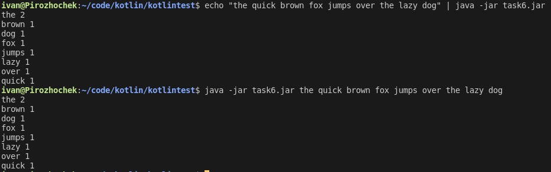

# kotlintest
### Решения задач теста

---
## Инструкция по компиляции и запуску:
  * Чтобы скомпилировать какой-либо из файлов используйте команду **kotlinc <_имя исходника_> -include-runtime -d <_имя полученного jar файла_>**
  * Для запуска используйте команду **java -jar <_имя jar файла_>**
---

## task1
### _Напишите приложение, которое на вход через параметры командной строки получит текст и выдаст список слов, разделенных пробельными символами._
### Пример вывода:

## task2
### _Слова из предыдущего задания должны быть отсортированы по алфавиту в возрастающем порядке_
### Пример вывода:

## task3
### _Слова из предыдущего задания должны быть уникальные_
### Пример вывода:

## task4
### _После каждого слова выведите количество повторений слова_
### Пример вывода:

## task5
### _Список должен быть отсортирован сначала по количеству повторений в убывающем порядке, в случае одинакового количества – по алфавиту_
### Пример вывода:

## task6
### _Если вашему приложению из задания 5 не передано ни одного параметра, то считайте список слов для сортировки из стандартного потока ввода (stdin), чтобы ваше приложение дополнительно могло запускаться вот так:_
> echo "the quick brown fox jumps over the lazy dog" | java -jar yourapp.jar
### Пример вывода:

